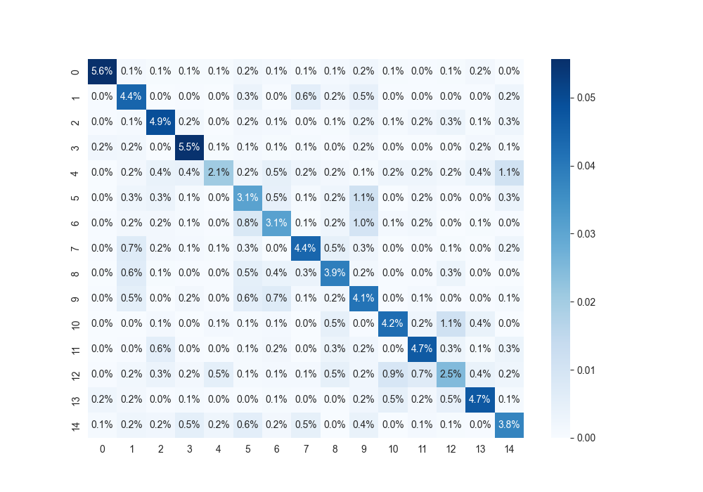

# ITMO action recognition task: dance recognition

## Dataset
Original dataset Kinetics 700-2020 ([paper](https://arxiv.org/abs/2010.10864))
contains labels, YouTube ids and timecodes. It`s available for downloading 
[here](https://storage.googleapis.com/deepmind-media/Datasets/kinetics700_2020.tar.gz).

Dancing dataset was created with [download_data.py](data%2Fdownload_data.py) and contains only dace types.

#### Usage
Download original dataset, unzip .csv files to [data](data) directory and run 
```
pip install -r ./data/requirements.txt
```
Windows:
```
python ./data/download_data.py dancing
```
Linux / Mac:
```
python3 ./data/download_data.py dancing
```

## Training
Open [train.ipynb](train.ipynb)

First time you must prepare dataset with section `Prepare dataset`

When dataset is prepared (videos moved to class directories), run other sections

Use any model, generated by custom function like `make_kinetics_mvit` from `Init model` section

## Results
### X3D-M (facebook research)
Accuracy: 0.60

F1 weighted: 0.59

Confusion Matrix:


### MViT 16x4 (facebook research)
Accuracy: 0.68

F1 weighted: 0.68

Confusion Matrix:


### Label ids
0 - belly\
1 - breakdancing\
2 - country line\
3 - ballet\
4 - charleston\
5 - gangnam style\
6 - macarena\
7 - jumpstyle\
8 - mosh pit\
9 - robot\
10 - salsa\
11 - square\
12 - swing\
13 - tango\
14 - tap
